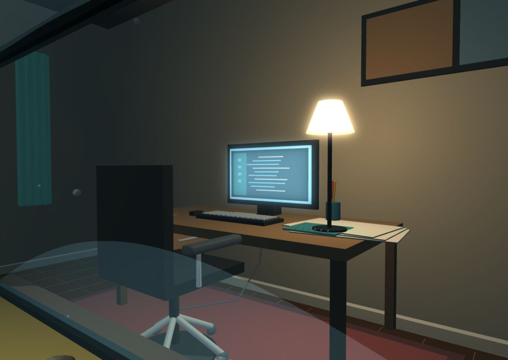
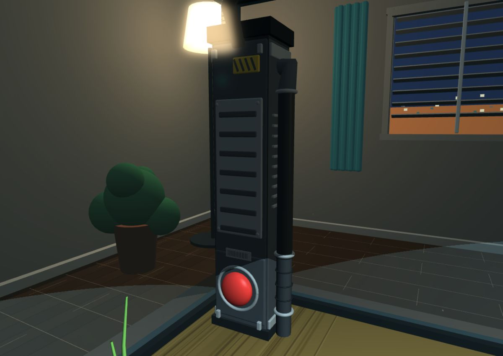

# Detail layers at the top two quality tiers

Three authored layers ride on the quality setting: the office, the zapper and
the sand floor. Battery Saver and Balanced keep the procedural base scene and
download none of it. Sharper (High) loads `office-high.glb`,
`zapper-high.glb` and `sand-tile-high.glb`; Ultra loads the denser trio. All
three follow the same lifecycle - only the selected tier is in memory, a
download that lands after the player has switched away is discarded rather than
shown, and a failed load leaves the base scene standing.

High adds a modeled monitor interface, individual keys, desk drawer and handle,
coffee rim/handle, notebook, cables, chair upholstery/arms/casters, display shelves,
books, plants, framed art and window details. Ultra adds curtains, floorboard
seams, pendant lighting, more artwork, notebook binding and paper markings.

The zapper receives a rounded shell, service panel, grille, screws, warning plate,
metal button bezel, clamps and intake fittings. Ultra adds cooling fins, ribbed
cable details, latches and a serial plate. Its existing button, status lamp,
stream and gameplay effects remain the active objects.

Both shots are from the running local game at Ultra, and the second is the one
worth checking after any change to the offsets below: the authored bezel has to
land around the procedural button rather than beside it.

All four office and zapper GLBs are authored in Blender and batched by material.
No external textures or extra real-time lights are needed. Only the selected
tier is loaded; switching down disposes the meshes and materials. Failed loads
retain the base scene. Office materials ignore underwater fog like the existing
room.

Sources: `assets/blender/environment/`. Exports and triangle counts:
`client/assets/environment/`. Regenerate with:

    blender --background --factory-startup --python tools/blender/create_office_details.py

The generator uses the room's Y-up coordinates, converted to Blender Z-up.
The loader explicitly corrects Babylon's glTF X reflection before positioning
zapper details at FILTER.x/FILTER.z. Do not remove that correction without
checking the desk alignment test.

## The sand floor

One seamless tile, 8 x 8 world units, laid nine by nine to cover the tank's
72 x 72 floor exactly: `high` is 2,048 triangles a tile and `ultra` 8,192, so
the floor costs 166k and 663k triangles respectively, all of it one batch
because every tile is a GPU instance of the one loaded mesh. Sources in
`assets/blender/sand/`, exports in `client/assets/sand/`, and
`docs/sand-preview.png` is four adjacent tiles under grazing light, which is the
render to check after any change:

    blender --background --factory-startup --python tools/blender/create_sand.py

Nine tiles fit with no rotation and no fitting because the tile is periodic in
every respect that shows. The ripple heights use whole-number frequencies so
opposite edges match in height _and_ slope; the noise behind both textures is
filtered with `np.roll` so the filter wraps as well; and vertex normals are set
analytically instead of averaged from faces, because an averaged normal at a
tile edge knows nothing about its neighbour and reads as a lit seam. Every tile
carries glTF's own mirrored root, which is harmless here for the same reason -
a mirrored edge still matches - and every tile is mirrored alike.

This is the one pack in the game that ships images: a 1024-square base colour
and a grain normal map, generated in numpy, packed into the `.blend` and
embedded in the `.glb`, so nothing is fetched alongside the model. That also
makes it the heaviest asset here at about 4 MB a tier, and incompressible - the
server's brotli pass will spend CPU on it for nothing, since the bytes are
already PNG.

`client/js/sand.js` is therefore the one material converter that has to carry
its textures across: the fish and scenery converters read `albedoColor` and
discard everything else, which for sand would discard the point of it. The
normal map is forced back to non-color data on the way over, or its vectors are
sampled as sRGB and the grain lights wrongly.

Brightness is split between lighting and emissive, because the floor's problem
is its range rather than its level. The hood spot is a cone from 36 units up:
the middle of the sand gets about 2.7x and the corners fall outside the cone
with only the 0.4 ambient, so a floor lit entirely by lights clips white in the
centre and goes black at the edges. The material takes 0.40 of the texture from
lighting and 0.45 as emissive, with the base texture in the emissive slot as
well so the lift carries the grain rather than flattening it into a wash - the
centre lands at 0.92 and the corners at 0.37, against 0.08 with no lift. Raise
`emissiveColor` in `sand.js` to brighten the dark edges, `diffuseColor` for the
lit middle. The procedural plane underneath is hidden rather than removed,
because the tile ripples about 5 cm either side of y = 0 and would fight a plane
left at exactly 0.

Worth a look from above during a playtest: the ripples run one way and the
pattern repeats on an 8-unit grid, so the tiling may read from height even
though the seams themselves do not show.

Verification: the full 50-test suite passes; `tests/environment.test.js` loads the
real GLBs on NullEngine and covers quality switching, material cleanup, stale
load rejection and desk alignment; `office-ultra.jpg` and `zapper-ultra.jpg`
above are the visual check. Performance on physical mobile devices has not been
measured.
